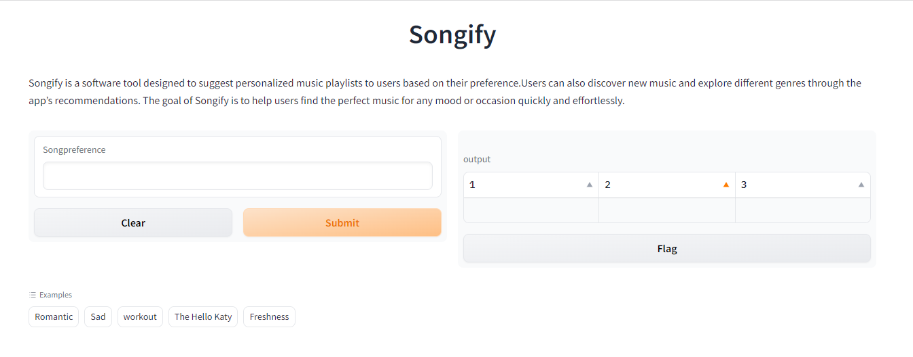

# Songify
Songify is a software tool designed to suggest personalized music playlists to users based on their preference.
Users can also discover new music and explore different genres through the app’s recommendations. 
The goal of Songify is to help users find the perfect music for any mood or occasion quickly and effortlessly.

# Dataset
Song Lyrics Dataset contains song lyrics of songs by various artists.The dataset can be downloaded from Kaggle.

dataset: https://www.kaggle.com/datasets/deepshah16/song-lyrics-dataset
